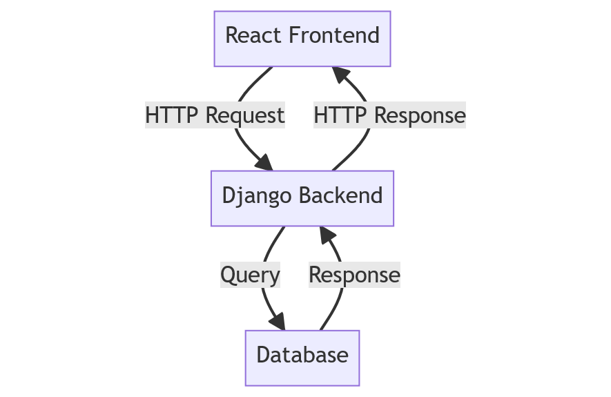

# Django + React P1
-- Build a To-Do application Using Django and React
## By Chau The Khanh

## Integrating Frontend And Backend For Efficient Web Development


## Technologies Used:
<ul>
    <li>Python 3.9</li>
    <li>Django 3.1.6</li>
    <li>Node 15.8</li>
</ul>
<ul>
    <li>djangorestframework 3.12.2</li>
    <li>django-cors-headers 3.7.0</li>
    <li>npm 7.5.4</li>
    <li>React 17.0.1</li>
    <li>axios 0.21.0</li>
</ul>

## 1. Setting Up The Development Environment
### 1.1 Install Django
- Open your terminal and run the following command: 
```bash 
pip install django
pip install djangorestframework django-cors-headers
```
- After installing Django, create a new Django project using the command below:
```bash
django-admin startproject backend
cd backend
python manage.py startapp todo
python manage.py migrate
python manage.py runserver
```

- You will need to create a “superuser” account to access the admin interface. Run the following command in your terminal:
```bash
python manage.py createsuperuser
```
```
# Username (leave blank to use 'your_computer_username'): name
# Email address: xxxx@gmail.com
# Password: ******
# Password (again): ******
```

- Navigate to `http://localhost:8000/api/todos` You can `CREATE` a new Todo item
- Navigate to `http://localhost:8000/api/todos/1` You can also perform `DELETE` and `UPDATE` operations on specific Todo items using the id primary keys

### 1.2 Install Node.js And NPM
Download and install them from the [official Node.js website](https://nodejs.org/en).

### 1.3 Create A React App
Create a new React app inside your Django project directory:
```bash 
npx create-react-app frontend
cd frontend
npm start
```

Next, install `bootstrap` and `reactstrap` to provide user interface tools.
```bash
npm install bootstrap@4.6.0 reactstrap@8.9.0 --legacy-peer-deps
nvm use 15.8.0
```


### 1.4 Configure Django Settings
### 1.5 Set Up Static Files
### 1.6 Run Development Servers
In one terminal, navigate to your Django project directory and run:
```bash
python manage.py runserver
```

In another terminal, navigate to your React app directory and run:
```bash
npm start
```


